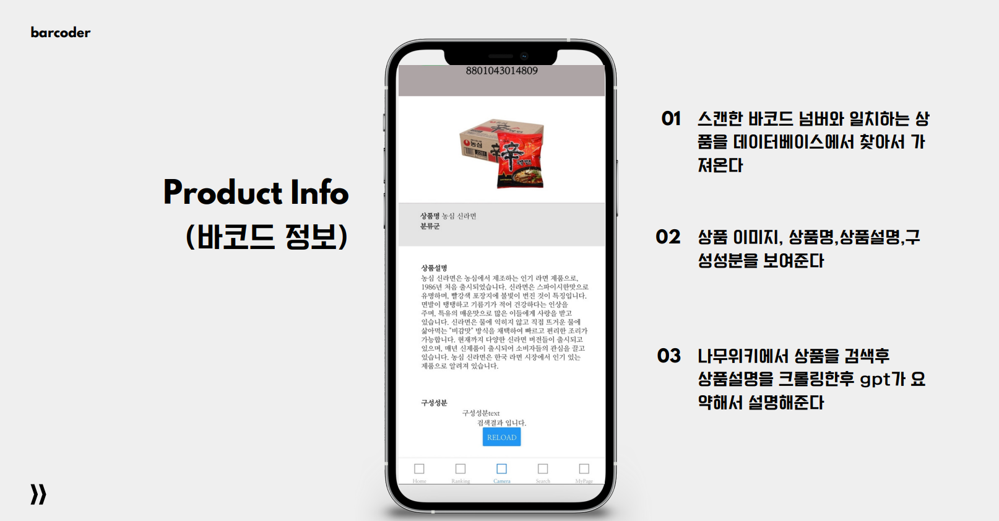

# barcode Project

### barcoder Project(바코더) : 인공지능, 바코드 기반 상품 정보 확인 서비스
> 1)효율적인 상품 정보 얻기: 이 프로젝트의 주요 목적은 바코드 정보를 활용하여 손쉽게 상품 정보를 얻는 것입니다. 고객들은 상품을 스캔하여 번역, 요약, 음성으로 듣는 등 다양한 방법으로 신속하게 상품 정보를 확인할 수 있을 것입니다.
> 
> 
> 2)다국적 사용자 지원: 외국인 여행객들을 포함한 국제적 사용자를 대상으로, 한 국가의 상품 바코드를 찍어 번역과 음성 설명을 제공함으로써, 다양한 언어와 문화를 고려한 서비스를 제공하는 것을 목표로 합니다
> 
> 3)확장성과 데이터 관리: 프로젝트의 확장성은 핵심 목표 중 하나입니다. 다양한 국가와 업체의 바코드 정보를 지원하고, 사용자가 스캔한 상품 정보를 어플리케이션 내에서 관리하는 기능을 제공하여 사용자 경험을 향상시킬 것입니다
>

-----------------------------------------------

<h3>BarCoder</h3>
</img> 
     

<h3>barcoder 미리보기</h3>
</img>
</img>  
</img>  

     

<h3>Barcoder 흐름도</h3>
</img>   

 

## barcoder 프론트 사용법
> 사용전 준비물 <VSCode, NodeJs, expo, react-Native >
1. 프로젝트를 클론 및 다운로드합니다.
2. 핸드폰에 Expo Go 어플을 다운로드해준다.
3. vsCode, NodeJs, Expo, react-native 를 준비해준다.
4. 터미널에 폴더 찾아가서 npm install로 프로젝트 모듈을 다운로드한다.
5. npx expo start -c 를 통해서 실행시켜준다.
6. 큐알코드를 핸드폰으로 스캔해준다.

프론트(React-Native) + 백엔드(Node.Js) + 데이터베이스(MariaDB)

데이터베이스 : (비공개)

